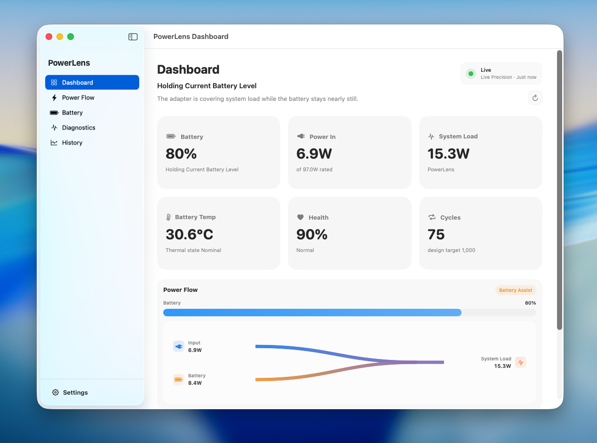
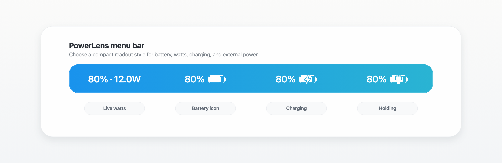
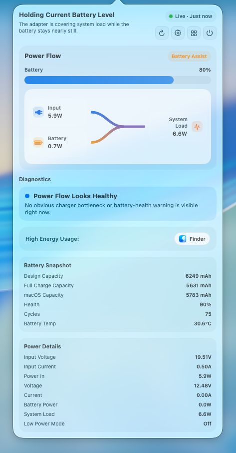
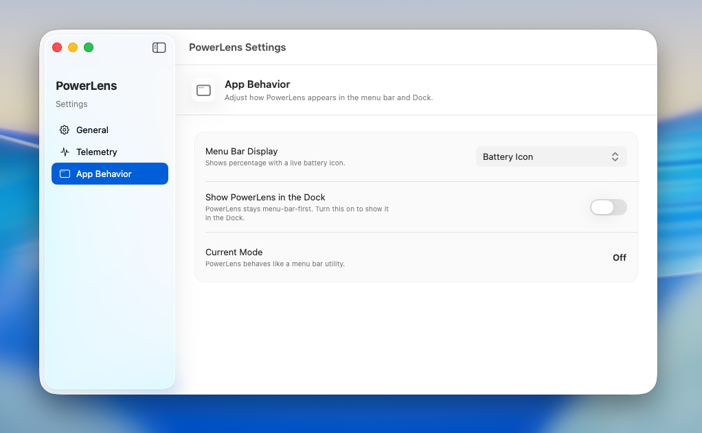

<div align="center">
  

  <h1>PowerLens</h1>

  <p><strong>Battery and power telemetry for the macOS menu bar.</strong></p>

  <p>
    <a href="LICENSE"></a>
    
    
    
  </p>
</div>

PowerLens is a macOS utility that makes battery and power flow visible at a
glance. It shows how power moves between the adapter, battery, and system load,
then surfaces the same information in a lightweight popover and a richer
dashboard.

## Why PowerLens

macOS can tell you the battery percentage, but it does not make the live power
story easy to read. PowerLens focuses on the questions that usually matter when
your Mac is connected to a charger, dock, display, or running on battery:

- Is the adapter covering the system load, or is the battery helping?
- Is the battery charging, holding, or discharging?
- Is the negotiated charger power lower than expected?
- Which app is currently using the most energy?
- Is the battery health, temperature, and cycle count still in a normal range?

## Quick Look

<p align="center">
  
</p>

<p align="center">
  <strong>Dashboard overview</strong><br>
  Live battery status, charger input, system load, battery health, cycles, and the current power-flow state in one place.
</p>

## Features

### Menu Bar Readout

<p align="center">
  
</p>

PowerLens lives in the macOS menu bar and can show a compact battery readout,
percentage, live watts, and charging or holding-state badges. It is designed to
work as a small utility first, with the Dock icon optional.

### Power Flow Popover

<p align="center">
  
</p>

The popover is the fast check: battery level, power-flow diagram, diagnostics,
high-energy app, battery snapshot, and raw power details. The flow diagram
distinguishes adapter-only power, battery-only power, battery assist, charging,
and holding-current states.

### Dashboard

The dashboard gives the same data more room. It is useful when you want to keep
an eye on charger behavior, compare input power with system load, or inspect
battery health and cycles without digging through command-line tools.

### Diagnostics

PowerLens watches for common power situations:

| Situation | What PowerLens highlights |
| --- | --- |
| Healthy external power | Adapter covers the current system load. |
| Battery assist | Battery supplements the adapter when load spikes. |
| Charging | Input power splits between system load and battery charging. |
| Holding current level | Adapter covers the system while the battery stays nearly still. |
| Negotiated power looks low | Charger, cable, dock, or display path may be limiting throughput. |

### Settings

<p align="center">
  
</p>

PowerLens includes app-language settings, telemetry-engine selection, menu bar
display styles, Dock visibility control, and update checking. The telemetry
engine can run in automatic, compatible, or live precision mode depending on the
Mac and the data available.

### Local History

Recent telemetry is stored locally so PowerLens can show history views and make
comparisons without sending your data anywhere.

## Requirements

- Build target: macOS 13.0 or later.
- Tested environment: macOS 26.
- Release validation currently focuses on macOS 26. PowerLens may run on
  earlier target-supported versions, but behavior can vary by macOS release and
  hardware model.
- A battery-equipped Mac for battery telemetry.
- Xcode command line tools or Xcode for building from source.

## Install

1. Download the latest `PowerLens-<version>.dmg` from
   [Releases](https://github.com/progresshans/powerlens/releases/latest).
2. Open the DMG.
3. Drag `PowerLens.app` into `Applications`.
4. Launch PowerLens from `Applications`.

Release builds are distributed as Developer ID signed and notarized macOS apps.
PowerLens can check for updates from the app menu or Settings when a release
build includes the configured Sparkle update feed. The update feed is published
through GitHub Pages from `docs/appcast.xml`.

### Verify The Download

Each release includes `PowerLens-<version>-checksums.txt`. To verify the DMG,
download the checksum file into the same folder as the DMG, then run:

```bash
grep "PowerLens-<version>.dmg$" PowerLens-<version>-checksums.txt | shasum -a 256 -c -
```

## Uninstall

Quit PowerLens, then remove `PowerLens.app` from `Applications`.

To delete local history and preferences as well, follow the steps in
[PRIVACY.md](PRIVACY.md#delete-local-data).

## Build From Source

```bash
swift build
swift test
./script/build_and_run.sh
```

`./script/build_and_run.sh` builds a local app bundle at `dist/PowerLens.app`
and launches it. Pass `debug`, `logs`, `telemetry`, or `verify` for the helper
modes documented in the script.

Release packaging notes for maintainers live in
[Packaging/README.md](Packaging/README.md).

## Privacy

PowerLens reads battery and power information locally on your Mac. It does not
send analytics, telemetry, or crash data to a server.

See [PRIVACY.md](PRIVACY.md) for the full local-data description.

## License

Copyright (C) 2026 HYEONJIN HAN.

PowerLens is licensed under the GNU Affero General Public License v3.0 only
(`AGPL-3.0-only`). See [LICENSE](LICENSE).
